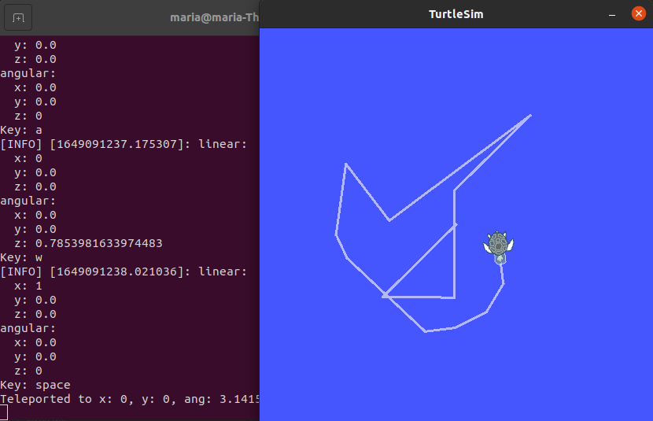

# Lab 1 Robotics: ROS Introduction
## Some of The Most-used Linux Commands 
... Cambio prueba
Cambio SSH

## Connecting ROS to Matlab

...

## Using Python with ROS

### What are we going to do?

Now that we have learned how to communicate Matlab with ROS, it is time to expand our power and use python too. To learn how to do this, we will write a short script that will allow us to control our little turtle with the keyboard. 

* It must move forward or backward by pressing W or S, respectively.
* It should rotate clockwise or counterclockwise by pressing D or A, respectively.
* It must return to the initial position and rotation by pressing R
* When pressing the space key it must rotate 180 degrees

Sounds interesting, doesn't it? But... How can we do it? In this section we will find this out.

### How do we do it?

Firstable we will create a script with the name *myTeleopkey.py* in the scripts folder of the package *hello_Turtle*. As shown in the image below, we are going to use Visual Studio Code to write and edit our code.


After doing this, we can begin to create our script. Since we will use python with ROS, we need to write at the beginning of the script some lines that will import tools needed to work with topics and services in ROS. All we have to do is to copy the code below.

```
#!/usr/bin/env python
#Script de python del nodo tipo Teleop_key para mover turtle

import rospy
from geometry_msgs.msg import Twist
from turtlesim.srv import TeleportAbsolute, TeleportRelative
import termios, sys, os
from numpy import pi

TERMIOS = termios
```

Now we are equipped and ready to code! 

According the statement at the beginning of this section, we will move the little turtle with keyboard keys. In order to do this, we have to read those inputs. To do that we are going to use the function called *getKey()*. This function can also be found [here](http://python4fun.blogspot.com/2008/06/get-key-press-in-python.html).

```
def getkey():
    fd = sys.stdin.fileno()
    old = termios.tcgetattr(fd)
    new = termios.tcgetattr(fd)
    new[3] = new[3] & ~TERMIOS.ICANON & ~TERMIOS.ECHO
    new[6][TERMIOS.VMIN] = 1
    new[6][TERMIOS.VTIME] = 0
    termios.tcsetattr(fd, TERMIOS.TCSANOW, new)
    c = None
    try:
        c = os.read(fd, 1)
    finally:
        termios.tcsetattr(fd, TERMIOS.TCSAFLUSH, old)
    return c
```
When calling this function, we get as return *c* the key that was just pressed. However, we get it with an additional character at the beginning. For example, if we press *h* we get *b'h'*. For us to get only the pressed key, we can change the last line of the function and write instead the following:

```
return str(c).replace('b', "").replace('\'', "")
```
Using that we can already get only the key that was pressed. 

Now we have to process that input acoording to the instructions. For moving forward or backward and rotate clockwise or counterclockwise we can use the topic */turtle1/cmd_vel*. In previous lab classes, we have already seen a function that publishes information to this topic. All this is done with the code below.

```
def pubVel():
    pub = rospy.Publisher('/turtle1/cmd_vel', Twist, queue_size=10)
    rospy.init_node('velPub', anonymous=False)
    vel = Twist()
    rate = rospy.Rate(10) 
    while not rospy.is_shutdown():
        vel.linear.x = 2
        vel.angular.z = 1
        rospy.loginfo(vel)
        pub.publish(vel)
        rate.sleep()
```
Let's understand the function *pubVel* better. The first thing that we do is create a publisher of the topic */turtle1/cmd_vel*. After this, we initiate the node and while the node is avaiable (not shutdown) we publish data to the topic. In this case we set the linear velocity in x to 1 and the angular velocity (radians) to 2. This sounds quite similar to the movements that our turtle has to do when we press W, S, D and A, doesn't it? Well, we have to modify the function a little bit and it should work for our purpose.

The original function *pubVel* doesn't have any parameters. If we call the function, it will always set the linear velocity in x to 1 and the angular velocity (radians) to 2. We must change that by adding to input parameters to the function. We will call them *move* and *rot* so that we set the linear velocity in x to mov and the angular velocity (radians) to rot.
```
def pubVel(mov, rot): #Comunicación con el tópico de velocidad. Se publica a ese tópico
    pub = rospy.Publisher('/turtle1/cmd_vel', Twist, queue_size=10)
    rospy.init_node('velPub', anonymous=False)
    vel = Twist()
    rate = rospy.Rate(10) 
    vel.linear.x = mov
    vel.angular.z = rot
    rospy.loginfo(vel)
    pub.publish(vel)
    rate.sleep()
```

And now we can just call our function and set the input parameters according to the key that we receive. 

* Key W: *pubVel(1, 0)*
* Key S: *pubVel(-1, 0)*
* Key D: *pubVel(0, -pi/4)*
* Key A: *pubVel(0, pi/4)*


Great! We can move and rotate. What are we missing now? We have to be able to return with R and to rotate 180 degrees with the space key. To do that we can use two services: */turtle1/teleport_absolute* and */turtle1/teleport_relative*. Thanks to the previous work in lab classes we already have a little bit of notion of how the communication with services works. Let's evaluate the following function, that was given to us previously.

```
def teleport(x, y, ang):
    rospy.wait_for_service('/turtle1/teleport_absolute')
    try:
        teleportA = rospy.ServiceProxy('/turtle1/teleport_absolute', TeleportAbsolute)
        resp1 = teleportA(x, y, ang)
        print('Teleported to x: {}, y: {}, ang: {}'.format(str(x),str(y),str(ang)))
    except rospy.ServiceException as e:
        print(str(e))
```

In the function *teleport* we wait for the service */turtle1/teleport_absolute* and then we pass the parameters *x, y, ang* to the service. This will result in a new position of the turtle according the values of those parameters like teleporting hence the name of the function. 

Once again we see similarities with the movements that we have to program. When we press R we can return to an original position using exactly the function *teleport* and passing the respective parameters. However, to rotate 180 degrees we have to take into account the initial rotation of our turtle and therefore the service */turtle1/teleport_relative* comes in handy. The latter works really similar to the previous one, the only difference is that the movement is relative to the current position and rotation and it receives only two input parameters: *x, ang*. With that in mind we can modify the function *teleport* by writing a conditional to identify when to use the relative and the absolute service. In this case, we do that with the input parameter *mode*, as shown below.

```
def teleport(x, y, ang, mode): #Servicio teleport para cambio de posición (absoluto o relativo)
    if mode == "a":
        service = "/turtle1/teleport_absolute"
        serviceMode = TeleportAbsolute
    else: 
        service = "/turtle1/teleport_relative"
        serviceMode = TeleportRelative
    rospy.wait_for_service(service)
    try:
        teleportA = rospy.ServiceProxy(service, serviceMode)
        if mode == "a":  resp1 = teleportA(x, y, ang)
        else:  resp1 = teleportA(x, ang)
        print('Teleported to x: {}, y: {}, ang: {}'.format(str(x),str(y),str(ang)))
    except rospy.ServiceException as e:
        print(str(e))
```

Ok! Now we are almost done. The only thing that we have to do now is to write a main function where we process each input and do the corresponding movement or rotation. At the beginning, we want the turtle to be at the initial position and with a velocity both linear and angular equal to zero. After that, and while the node is active, we will move according to the keyboard key inputs. 
```
if __name__ == '__main__':
    try:
        teleport(5.5, 5.5, pi/2, "a")
        pubVel(0, 0)
        while not rospy.is_shutdown():
            entrada = getkey()
            if entrada == "w":
                print("Key: w")
                pubVel(1, 0)
            elif entrada == "s":
                print("Key: s")
                pubVel(-1, 0)
            elif entrada == "d":
                print("Key: d")
                pubVel(0, -pi/4)
            elif entrada == "a":
                print("Key: a")
                pubVel(0, pi/4)
            elif entrada == "r":
                print("Key: r")
                teleport(5.5, 5.5, pi/2, "a")
            elif entrada == " ":
                print("Key: space")
                teleport(0, 0, pi, "r")
            else:
                print("Key not recognized")
    except rospy.ROSInterruptException:
        print("Ups, error")
        pass
```

And that's it! It should work now. 

### Verify if it works

In order to verify the script and the use of Python with ROS we can follow this procedure:

* Include the current script to the file *CMakeLists.txt* found in the folder *hello_turtle*. We do this in the same way as the other files were included.


* Open three terminals and run the following commands:
    * Terminal 1: *roscore* (it initializes the master node)
    * Terminal 2: *rosrun turtlesim turtlesim node* (it runs the node of the turtle)
    * Terminal 3: *source devel/setup.bash* (When sourcing we update and take all the new changes into account). After sourcing we run *rosrun hello turtle myTeleopKey.py* (It runs the code that we wrote in this section)

Now it should work. Pressing W, S, D, A, R or the space key should move and rotate the turtle according to the specifications :D (See the abstract art below to see an example of it should look like)




## Conclusions

The potential of ROS is huge. Developing the ability to connect it with different tools such as Matlab and Python helps us to understand its functionality and applicability to different projects. This lab helped us to reinforce the understanding of concepts like nodes, topics and services which are core fundamentals in this environment 
